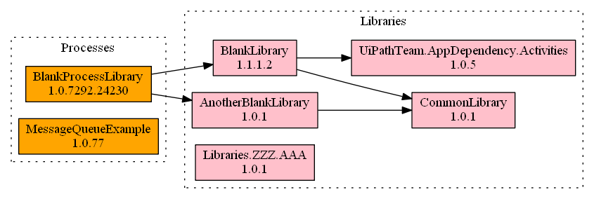
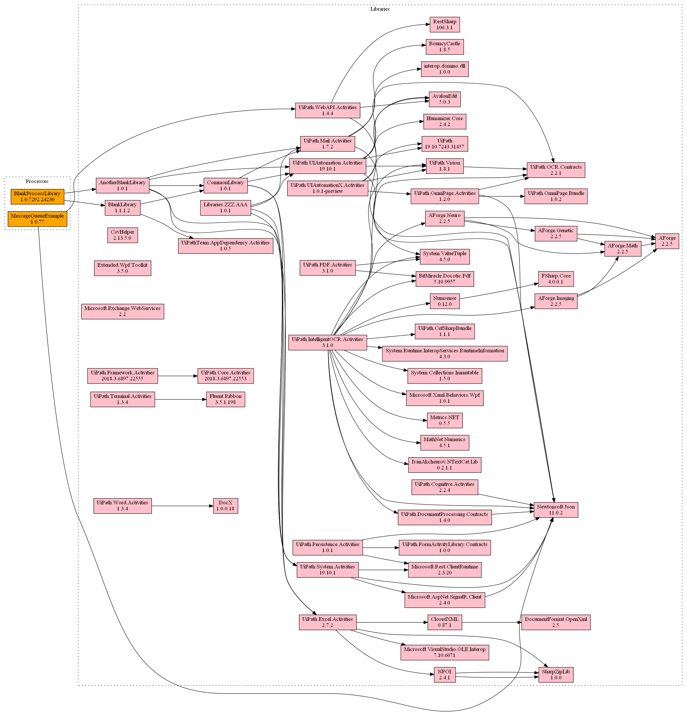

# DependencyViewer

This tool draws the dependency tree of all Processes and Libraries on an Orchestrator.
The graph that is grenerated can be really useful to know which Processes or Libraries need to be re-tested after a modification. 

For instance, if _CommonLibrary_ is modified, both libraries _BlankLibrary_ and _AnotherBlankLibrary_ as well as the _BlankProcessLibrary_ process will have to be re-tested. This ability to pinpoint changes cuts the time needed for developers and testers to get their changes deployed.

## Prerequisites

**You will need to install Graphviz for this to work**

You can install Graphviz here: [https://graphviz.gitlab.io/_pages/Download/Download_windows.html] 

## Config file

The GeneralConfig Tab in the config file Config.xlsx contains general config about the Orchestrator such as:
- Endpoint: the URL of the Orchestrator (no slash / at the end)
- Tenant: e.g. Default
- Username: e.g. Admin
- Password: e.g. qwerty123
- TempFolder: the location of the folder where the nupkg files are going to be downloaded and unpacked e.g. temp (don't change)
- OutputFileName: e.g. output
- OutputFileExtension: e.g. png
- GraphvizLocation: the location of the Dot.exe executable of Graphviz

## Filtering

In the LibrariesFilter Tab, you fill find a list of Libraries to filter on. This will only consider the Libraries in the Table when extracting dependencies from Processes/Libraries. If you leave this table blank, it will NOT filter any Libraries resulting in a more difficult to understand graph (see below)

